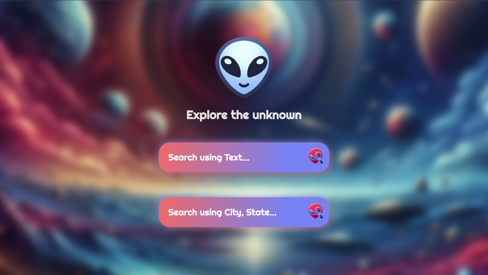
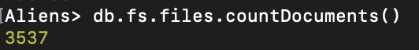

<!-- PROJECT LOGO -->
 

    

<h2 align="center">Aliens</h2>

<!-- TABLE OF CONTENTS -->

<h2>Table of Contents</h2>

  <ol>
    <li><a href="#Tecnology-stack">Technology Stack</a></li>
    <li><a href="#process">Process</a></li>
    <li><a href="#volume">Volume</a></li>
    <li><a href="#variety">Variety</a></li>
    <li><a href="#bells-whistles">Bells and Whistles</a></li>
    </li>
</ol>

<!-- ABOUT THE PROJECT -->
## About The Project

### Built With

* [Mongo][Mongo-url]
* [Express][Express-url]
* [React][React-url]
* [Node][Node-url]

## Technology Stack
Our application is constructed using ReactJS for the front end and NodeJS with Express for the backend interface. 
MongoDB serves as our database.

## Process
We have loaded our database with Mongo commands. The major setback we had during this process was to extract images. Our dataset did not have images, so we had to get the images from the report link that was present in the database. To do so we wrote a python script to extract and download the images which was then uploaded to gridFS.

## Volume

## Variety
1. "craft with grey" as text input will give one result which when clicked will give out the report with the appropriate image and comments.

2. The phrase "green light", yeilds a result with title "Blinking or pulsating circular green light in the southern sky just below the Moon.". on clicking this card, we can see an interesting image of a green UFO object.

3. For location "Dallas,TX", we get various search results with card titles: "managed to snap two pics looking east at 45 degrees" and "Dark triangular UFO" and "A large disk craft hovered over 635, then instantly shot off to the south, hovered as a white light on the horizon, then disappeared" 
All these have original images and the entire image gallery can be viewed in the report link.

4. for Location "seattle,WA", we get a result card with title "Orange light over seattle" when clicked on this card, we can see a very interesting image of a UFO sighting.

5. Honolulu, HI - "Two bright oval objects, appear to be lined up, stationary, lights are ring-shaped."

6. word search "eclipse" produces a result with title "CLear veiw of very large craft on night of Moon eclipse". on clicking, this you will be able to see one of the longest articles in the database.

## Bells and Whistles
As a group we performed exceptionally well to complete all parts of the project. We are particularly proud of how we present our application, its UI and our image retrieval from GridFS. 
We created the image dataset on our own by scraping the web for the images.
We have used ReactJS to develop our frontend. We have handled data and gridFS exceptionally well and managed to get all the elements to the finish line.

<!-- MARKDOWN LINKS & IMAGES -->
<!-- https://www.markdownguide.org/basic-syntax/#reference-style-links -->

[React.js]: https://img.shields.io/badge/React-20232A?style=for-the-badge&logo=react&logoColor=61DAFB
[React-url]: https://reactjs.org/
[Mongo-url]: https://www.mongodb.com/docs/manual/installation/
[Express-url]: https://expressjs.com/en/starter/installing.html
[Node-url]: https://nodejs.org/en/about